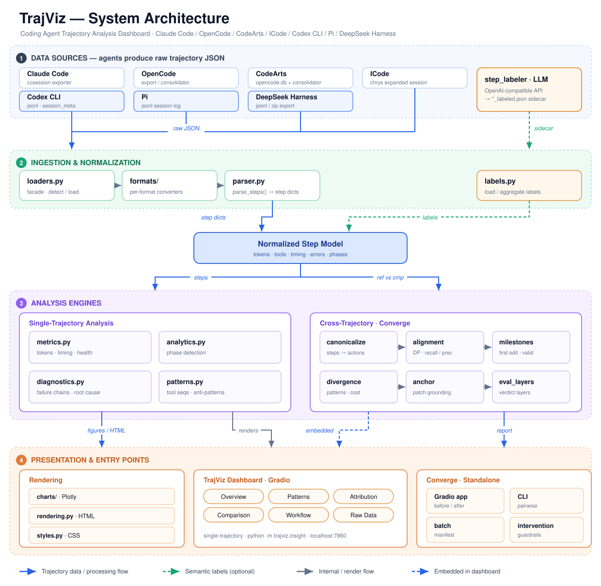

# TrajViz

**Offline analytics & visualization for LLM agent trajectories.**

TrajViz loads a single agent trajectory (or compares two), parses it into a normalized step model, and renders an interactive Gradio + Plotly dashboard covering tokens, timing, tool-use patterns, phase composition, anti-pattern detections, step-label analysis, and cross-trajectory divergence.

Supports trajectories from **Claude Code**, **Cursor**, **OpenCode**, **CodeArts**, **ICode**, **Codex CLI**, **Pi**, and **DeepSeek Harness** out of the box.

---

## Architecture

TrajViz ingests raw agent-trajectory JSON, normalizes it into a shared step model, runs single- and cross-trajectory analysis over that model, and renders the results in a Gradio + Plotly dashboard.



---

## Install

```bash
git clone https://github.com/rshu/TrajectoryVisualizer.git
cd TrajectoryVisualizer
```

Pick one of the workflows below. Requires Python 3.11+.

### uv (recommended)

[`uv`](https://github.com/astral-sh/uv) is the fastest path and produces a
reproducible `uv.lock`. From the repo root:

```bash
uv sync                              # creates .venv, installs the project + deps
```

That's it — no separate `pip install -e .` step. To add or upgrade a dependency
later, use `uv add <pkg>` / `uv lock --upgrade`.

### pip

```bash
pip install -e .                     # package-managed
# — or —
pip install -r requirements.txt      # plain requirements file
```

---

## Run

Launch the dashboard:

```bash
# uv
uv run trajviz
# or
uv run python -m trajviz.insight

# pip / activated venv
python -m trajviz.insight
# or
trajviz
```

Default: `http://localhost:7860`. Upload a trajectory JSON via the file picker at the top of the UI. After load, **Export HTML** downloads a standalone Overview + charts + Patterns snapshot (charts stay interactive via Plotly's CDN).

Headless report, no dashboard:

```bash
python -m trajviz.insight --report path/to/trajectory.json -o report.html
```

The **AI Trajectory Analysis** sidebar starts closed; open it from the
labeled control on the right edge. It runs an automatic analysis
when a trajectory loads, then answers follow-up questions. It uses the same
dashboard statistics (health verdicts, bottlenecks, failures, fruitless
streaks) and replies in Simplified Chinese. It does not re-upload the raw
file. Configure the model in `.env`:

```bash
cp .env.example .env
# set ANALYZE_BASE_URL / ANALYZE_API_KEY / ANALYZE_MODEL
# (LABEL_* from the step labeler is used if ANALYZE_* is omitted)
```

| Variable | Meaning |
|---|---|
| `ANALYZE_BASE_URL` | API base URL (OpenAI-compatible, or Anthropic messages) |
| `ANALYZE_API_KEY`  | API key |
| `ANALYZE_MODEL`    | Model name, e.g. `gpt-4o-mini`, `glm-4.6` |

Optional: `ANALYZE_PROVIDER` (`openai` \| `anthropic`, default `openai`),
`ANALYZE_TEMPERATURE` (default `0.2`), `ANALYZE_MAX_TOKENS` (default `2048`),
`ANALYZE_TIMEOUT` (default `120`). `.env` is gitignored.

Custom port or host (prefix any of these with `uv run` when using uv):

```bash
# Different port
python -m trajviz.insight --port 8080

# Access from any IP on the network
python -m trajviz.insight --host 0.0.0.0
# Then access it via your server's IP address: `http://YOUR_IP:7860`

# Create a public share link
python -m trajviz.insight --share
```

---

## Common Issues

### Server cannot start

If the dashboard fails to start or shows connection errors, your environment may be using a proxy configuration that interferes with localhost connections. Add `127.0.0.1,localhost` to the `no_proxy` environment variable:

```bash
# Linux/Mac
export no_proxy="127.0.0.1,localhost,$no_proxy"

# Windows (PowerShell)
$env:no_proxy = "127.0.0.1,localhost,$env:no_proxy"

# Windows (CMD)
set no_proxy=127.0.0.1,localhost;%no_proxy%
```

### Port already in use

If port 7860 is already in use, specify a different port:

```bash
python -m trajviz.insight --port 8080
```

---

## Supported trajectory formats

trajviz normalizes the following formats. **Auto-detect** is the default —
upload a `.json` / `.jsonl` / `.zip` file and load it. Pick a specific format only to
override detection or to load a Claude Code export that lacks the usual
`format` marker. An explicit pick still rejects a mismatched JSON file
(Codex, Pi, and DeepSeek Harness `.jsonl` sessions, and ICode expanded-session
JSON, are recognized regardless of the dropdown):

| Format | Detection | Notes |
|---|---|---|
| Claude Code | `format: ccsession-trajectory` | Full support: tokens, cache, tool calls, thinking. Produced by [ccsession](https://github.com/rshu/ccsession) (see below). |
| Cursor | `export_metadata.source_format: cursor_composer` | Consolidated from local `agent-transcripts` JSONL + Composer `state.vscdb`. Tool inputs always; tool outputs, step clocks (`startedAtMs`/`completedAtMs`), and context-window occupancy when the DB row is present. Per-step token bars are ≈4-chars/token estimates of logged text and tools — Cursor does not persist billed per-request tokens. |
| OpenCode | `info` + `messages` shape | Includes sub-agent sessions |
| CodeArts | `export_metadata.source_format: codearts_opencode_sqlite` with schema version 2 | Preserved token breakdown and consolidated parent/sub-agent sessions |
| ICode | `_chrys_export.format: chrys-expanded-session-v1` (or `meta` + `state.messages`) | Normalized from a Chrys expanded-session JSON; `glob` / `grep` / `sh` / `explore_agent` mapped into the shared step model. Nested `_chrys_sub_agent_sessions` are flattened. |
| Codex CLI | `.jsonl` rollout starting with a `session_meta` event | Normalized into the shared step model (Auto-detect recognizes `.jsonl` uploads); tool intent (Read / Grep / Glob / Write / Bash) inferred from classic `exec_command` calls and modern `exec` / `apply_patch` records |
| Pi | `.jsonl` session starting with a `session` event | Normalized from `~/.pi/agent/sessions/` exports; `bash` / `read` / `write` / `edit` / `grep` mapped into the shared step model |
| DeepSeek Harness | `.jsonl` session starting with a `session` header that has `createdAt` (epoch ms) and slash-typed body events (`user/message`, `tool/call`, …) | Normalized from a DSH export folder or zip (`session.jsonl` + `subagents/<id>/session.jsonl`); `bash` / `read` / `write` / `glob` / `todo_write` / `subagent_fork` mapped into the shared step model. Child logs drop the inherited parent prefix (`seedLength`). |

---

## Failure attribution (DECAF)

The **Attribution** tab explains *why* a failed run failed: it diagnoses which of
seven workflow capabilities broke — Requirement Understanding, Task Planning,
Code Localization, Code Editing, Code Verification, Self-Repair Loop, Tool Use —
and grounds each fault in tiered evidence (**deductive** set-arithmetic /
**associational** trajectory fact / **model-inferred** LLM judge). It shows a
primary-cause banner, a per-capability scorecard, and a collapsible evidence
chain (observation → inference → conclusion, with verbatim trajectory quotes and
a tamper-evidence audit verdict) for each fault.

The attribution is powered by the DECAF (`awe`) method, imported as a library
through `trajviz/insight/attribution.py`. DECAF is currently part of a private
research monorepo (a public artifact release is planned with the accompanying
paper) — so this feature is usable today only if you have a DECAF checkout:
clone it and point `AWE_DECAF_PATH` at it (default: a sibling `../DECAF`
directory). Without DECAF, TrajViz runs fully standalone and the Attribution
tab degrades to an informative notice. It is **gold-grounded** — it
needs the task's reference patch and test outcome — so it works on trajectories
from a gold corpus laid out as
`<corpus_root>/data/{requirements,patch,trajectory}/` plus
`eval_<agent>.json`, with trajectories at
`.../trajectory/<agent>/<instance_id>.json`. The corpus root is set via the
`AWE_ARGUS_ROOT` environment variable (default: a sibling `../TraceProbe`
checkout). When a trajectory is loaded from such a path, its
`(agent, instance_id)` are auto-detected and the tab populates on load; for an
uploaded file, set them in the tab's override fields. The uploaded file must be
byte-identical to the corpus copy of that run — a re-formatted or re-saved
export, or your own fresh run of the same instance, is refused, because the
gold-grounded verdict is only valid for the exact canonical trajectory bytes.
Without a reference patch the tab degrades honestly (trajectory-only signals)
rather than guessing.

The deductive/associational slice (five capabilities) runs fully **offline with
no API key**; the two judge capabilities are read back from cached verdicts when
present. DECAF is stdlib-only and located at runtime via `AWE_DECAF_PATH`
(default: a sibling `../DECAF` checkout). See
[`docs/decaf-integration-plan.md`](docs/decaf-integration-plan.md) for the
architecture and rollout.

---

## Collecting trajectories

trajviz only **reads** trajectory files — producing them is the agent's responsibility. This section shows how to obtain a valid trajectory JSON for each supported agent.

### Claude Code

Claude Code writes one JSONL file per session under
`~/.claude/projects/<url-encoded-cwd>/<session-id>.jsonl`. The raw JSONL is not
directly consumable — use the [**ccsession**](https://github.com/rshu/ccsession)
exporter to convert it into the `ccsession-trajectory` JSON format that
trajviz expects.

1. Install `ccsession` (see the tool's README for current instructions).
2. Run a Claude Code session against your repo as normal (`claude` CLI or VS
   Code extension).
3. Find the session ID — it is the basename of the most recent `*.jsonl`
   under `~/.claude/projects/<project>/`, and is also echoed at the top of
   each Claude Code session.
4. Export that specific session with `ccsession`'s export mode. Example with
   a real session ID:
   ```bash
   ccsession export --session-id f33cdb42-0a41-40d4-91eb-c89c109af38a
   ```
   This writes an export folder containing
   several files (`trajectory.json`, `raw_messages.jsonl`,
   `conversation_full.md`, …).
5. Upload the resulting `trajectory.json` in the
   Insight dashboard — the loader detects the `format: ccsession-trajectory`
   marker and normalizes the step model automatically.

### Cursor

Cursor stores each Agent chat as JSONL under
`~/.cursor/projects/<workspace>/agent-transcripts/<chat-id>/` plus Composer
metadata in `state.vscdb`. TrajViz does not read those stores live — export
with the consolidator:

1. Copy the chat id from the chat header menu (**Copy ID**, not Copy Request
   ID). It is also the transcript folder name.
2. Export that chat (parent + subagents, joined with Composer metadata):
   ```bash
   python scripts/cursor_consolidator.py <chat-id> cursor_trajectory.json
   ```
   On this WSL setup the DB is typically
   `/mnt/c/Users/<user>/AppData/Roaming/Cursor/User/globalStorage/state.vscdb`.
   Override with `CURSOR_STATE_VSCDB` or `--db` if needed. `CURSOR_PROJECTS_DIR`
   overrides `~/.cursor/projects`.
3. List known chats:
   ```bash
   python scripts/cursor_consolidator.py --list
   ```
4. Upload `cursor_trajectory.json` in the Insight dashboard. The loader
   detects `export_metadata.source_format: cursor_composer`. Context occupancy
   (`promptTokenBreakdown` and `tokens.context_window`) is a **window snapshot**.
   Per-step duration comes from Composer tool/thinking clocks. Per-step token
   bars use a ≈4 chars/token estimate of logged text and tools, not billed
   API usage.

### OpenCode

OpenCode stores sessions in its local store (`~/.local/share/opencode/`; on
Windows `%USERPROFILE%\.local\share\opencode\`) and
exposes an `export` command that writes trajectory JSON to stdout.

1. Run an OpenCode session as normal.
2. List recent sessions and pick the one you want — **run this from the same
   working directory where the session was created**; `opencode session list`
   is scoped to the current directory's project ID:
   ```bash
   cd /path/to/your/project
   opencode session list --format json -n 10
   ```
3. Export the chosen session to JSON. Two paths depending on whether the
   session spawned sub-agents:

   **Typical case — no special sub-agents.** Use OpenCode's built-in
   exporter (banner output goes to stderr, so redirection produces a clean
   file):
   ```bash
   opencode export <session-id> > op_trajectory.json
   ```

   **Customized case — session has special sub-agents.** Sub-agent invocations live
   under their own session IDs, so `opencode export` on the parent only gives
   you the parent's messages. Use the consolidator helper in `scripts/` to
   recursively pull the parent and every child session into one JSON:
   ```bash
   python scripts/opencode_consolidator.py <session-id> op_trajectory.json
   ```
   The consolidator follows tool-call metadata to discover child session IDs
   and emits a flat `{"sessions": [...]}` structure that the loader threads
   into a single trajectory. It looks for `opencode.db` under
   `~/.local/share/opencode/` (and on Windows also `%LOCALAPPDATA%\opencode\`
   and `%APPDATA%\opencode\`). Override with `OPENCODE_DATABASE` if needed:
   ```powershell
   $env:OPENCODE_DATABASE = "$env:USERPROFILE\.local\share\opencode\opencode.db"
   python scripts/opencode_consolidator.py <session-id> op_trajectory.json
   ```
4. Upload `op_trajectory.json` in the Insight dashboard. The loader detects the
   `info` + `messages` shape automatically; sub-agent sessions are threaded in.

### CodeArts

Current CodeArts AgentKernel builds persist sessions in an `opencode.db`
SQLite store. Export a root session together with all child/sub-agent
sessions using the read-only consolidator:

```bash
python scripts/codearts_consolidator.py path/to/opencode.db \
  --session-id <session-id> --output ca_trajectory.json
```

The consolidator follows both `session.parent_id` and tool-result session
metadata, preserves stored token dictionaries and precise part timing, and
emits the `info` + `messages` envelope with an `export_metadata` block whose
`source_format` is `codearts_opencode_sqlite` — the marker the dashboard
detects. Pass `--no-children` only when a root-only export is intentional. A
bare session ID can also be used when `CODEARTS_DATABASE` or
`OPENCODE_DATABASE` points at the database.

Upload the export JSON and select **CodeArts**. Already-consolidated export
files can of course be uploaded directly.

The consolidator can also merge an old folder-based session
(`chat_baseInfo.json` + every `messages_<n>.json` shard) into a single
archival JSON. That legacy output preserves the original message records for
reproducibility but is **not** loadable by the dashboard, which only supports
the current export format.

### ICode

ICode (Chrys) expanded-session exports are a JSON object with `meta`,
`state.messages`, and `_chrys_export.format: chrys-expanded-session-v1`.
Sub-agent runs are nested under `_chrys_sub_agent_sessions` in the same file.

1. Export the session from ICode / chrys-manager as expanded session JSON
   (not the compressed transcript).
2. Upload the `.json` file. Auto-detect recognizes the Chrys envelope.
   `glob` / `grep` / `sh` / `explore_agent` map into the shared tool
   vocabulary, and nested sub-agent sessions are threaded into the step model.

### Codex CLI

Codex CLI records every session automatically as a JSONL rollout under
`~/.codex/sessions/` (date-bucketed `rollout-<timestamp>-<session-id>.jsonl`
files) — no exporter needed.

1. Run a Codex session as normal.
2. Locate the rollout file for the session — the most recent
   `rollout-*.jsonl` under `~/.codex/sessions/`.
3. Upload the `.jsonl` file. Auto-detect (the default) recognizes the
   leading `session_meta` event and threads the rollout into the shared
   step model. Per-step tool intent (Read / Grep / Glob / Write / Bash)
   is inferred from classic `exec_command` calls and modern `exec` /
   `apply_patch` records.

### Pi

Pi records every session automatically as JSONL under
`~/.pi/agent/sessions/<url-encoded-cwd>/`. No exporter is needed.

1. Run a Pi session as normal.
2. Locate the session file — the most recent `*.jsonl` under
   `~/.pi/agent/sessions/` (directories are named from the working folder).
3. Upload the `.jsonl` file. Auto-detect (the default) recognizes the
   leading `session` event and threads messages, thinking, tool calls
   (`bash` / `read` / `write` / …), and token usage into the shared step
   model.

### DeepSeek Harness

DeepSeek Harness (DSH) records each session as JSONL. The GUI export is a
folder (or zip) named `dsh-session-<session-id>/` containing the parent
`session.jsonl` and, when the run spawned sub-agents, `subagents/<id>/session.jsonl`.

1. Run a DSH session as normal.
2. Export / download the session log from the DSH GUI (zip), or copy the
   session directory.
3. Upload the **zip** (GUI exports put `session.jsonl` and `subagents/` at
   the zip root). That is the path that works on a hosted dashboard — the
   server never sees the uploader's `~/Downloads`. Auto-detect recognizes the
   leading `session` header (`createdAt`, slash-typed events) and does **not**
   treat it as a Pi log. Child sessions are merged from zip members, or from a
   sibling `subagents/` tree when you load a session directory (or
   `session.jsonl` next to that tree) on the same machine. Uploading a
   lone `session.jsonl` on a hosted dashboard cannot pick up children —
   the server has no access to the uploader's filesystem. Operators can
   set `TRAJVIZ_DSH_EXPORT_ROOT` to a directory on the host that contains
   the export (or `dsh-session-<id>/`). Inherited parent turns at the
   front of each child log are skipped.

---

## Scripts

Helper utilities that live in `scripts/` (run from the repo root):

| File | Purpose |
|---|---|
| `cursor_consolidator.py` | Read-only export of a Cursor Agent chat: JSONL transcripts + Composer `state.vscdb`, including subagent sessions. See the **Cursor** collection section above. |
| `codearts_consolidator.py` | Read-only export from a CodeArts `opencode.db` with recursive child sessions, or lossless archival merge of legacy `messages_<n>.json` shards. See the **CodeArts** collection section above. |
| `opencode_consolidator.py` | Recursively merge an OpenCode parent session and child sub-agent sessions into a single JSON. See the **OpenCode** collection section above. |
| `step_labeler_v2.py` | **Preferred** LLM step classifier. Emits one label record for **every** parsed step: assistant steps via the LLM, user steps as deterministic `user/user_prompt`, with `index`/`raw_index` preserved for exact source mapping. |
| `step_labeler.py` | Shared taxonomy/LLM helpers used by v2, plus a **compat CLI** that routes to v2 in assistant-only mode (`*_labeled.json`). Prefer `step_labeler_v2.py` for new work. |
| `TAXONOMY_REFERENCE.md` | Authoritative list of phase and action tags the labeler emits. Auto-loaded by the labeler from its own directory. |

### Labeling a trajectory

Use **`step_labeler_v2.py`** for new sidecars. It makes live LLM calls via
`requests`, which is installed by default with the rest of the project.

The labeler needs three config values — provide them via a `.env` file (in
the repo root or CWD) or as CLI flags. A sample
[`.env.example`](./.env.example) ships with the repo; copy it and fill in
your own key:

```bash
cp .env.example .env
# then edit .env and set LABEL_BASE_URL / LABEL_API_KEY / LABEL_MODEL
```

Required variables and their CLI-flag equivalents:

| Variable | CLI flag | Meaning |
|---|---|---|
| `LABEL_BASE_URL` | `--base-url` | API base URL (OpenAI-compatible) |
| `LABEL_API_KEY`  | `--api-key`  | API key |
| `LABEL_MODEL`    | `--model`    | Model name, e.g. `gpt-4o-mini`, `glm-4.6` |

Optional: `LABEL_PROVIDER` (`openai` | `anthropic`, default `openai`),
`LABEL_TEMPERATURE` (default `0.3`), `LABEL_MAX_TOKENS` (default `1024`).

Example invocations:

```bash
# Preferred: full-index v2 sidecar
python scripts/step_labeler_v2.py cc_trajectory.json --output cc_trajectory_labeled_v2.json

# Compat CLI: assistant-only sidecar (still routes through v2)
python scripts/step_labeler.py cc_trajectory.json --output cc_trajectory_labeled.json

# Overriding config on the command line
python scripts/step_labeler_v2.py cc_trajectory.json \
    --output cc_trajectory_labeled_v2.json \
    --base-url https://api.openai.com/v1 \
    --api-key sk-... \
    --model gpt-4o-mini
```

Upload the trajectory **and** its labels sidecar in the dashboard's two upload
slots to unlock phase-aware analytics and label-phase charts.

---

## License

MIT — see [LICENSE](./LICENSE).
